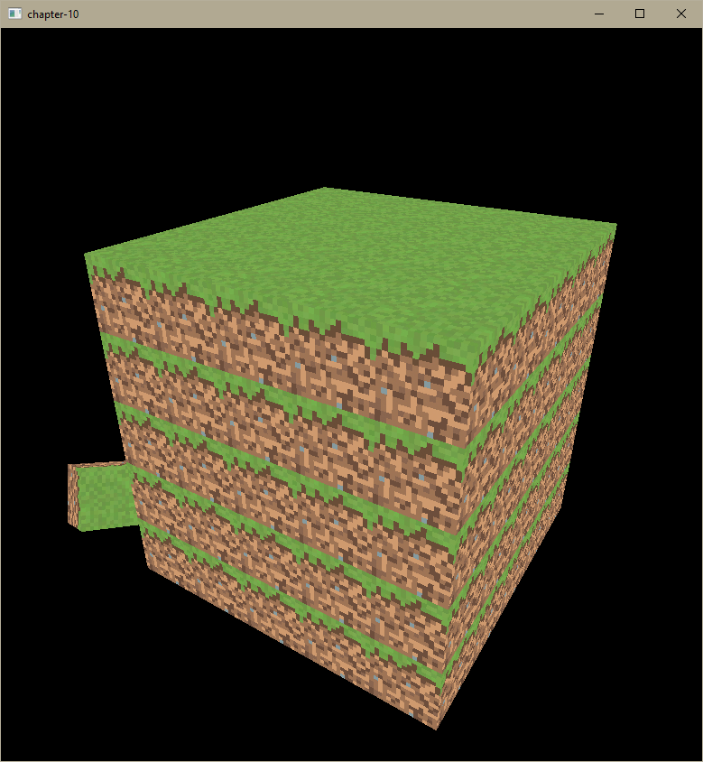
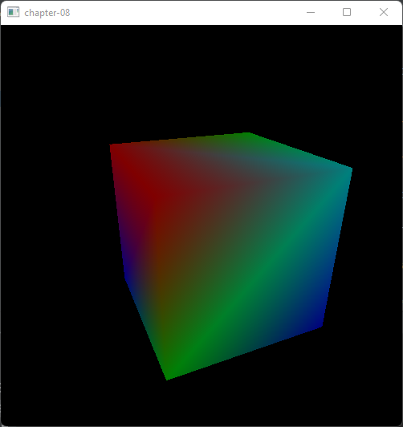
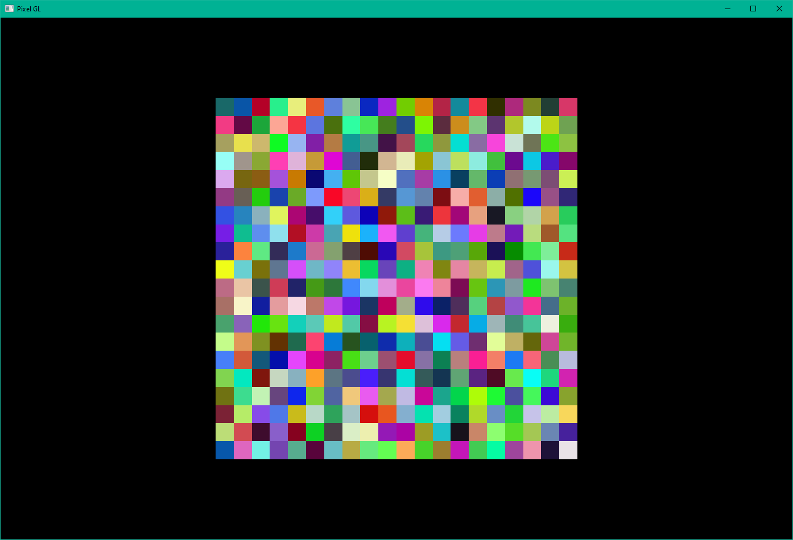

# Java project to learn openGL on my free time.

## Following tutorial from:

* [old-lwjglgamedev](https://lwjglgamedev.gitbooks.io/3d-game-development-with-lwjgl/content/)
* [GitHub_lwjglbook](https://github.com/lwjglgamedev/lwjglbook)
* [lwjglbook](https://ahbejarano.gitbook.io/lwjglgamedev/)
* [usefull video](https://www.youtube.com/watch?v=3HYAtYyLar0)

### Should probably follow his other tutorial on vulkan

* [vulkanbook](https://github.com/lwjglgamedev/vulkanbook)

### Notes

Probably should read:

* “3D Math Primer for Graphics and Game Development", by Fletcher Dunn and Ian Parberry

## Screenshots

